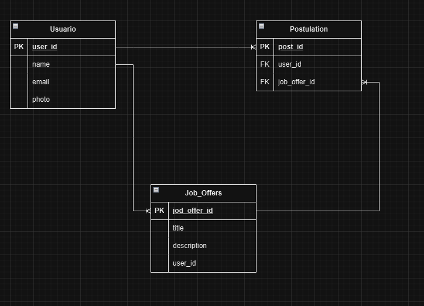

Prueba - Desarrollo de aplicaciones con Ruby on Rails

Modulos 6

Alumna Carola Pulgar

Requerimientos
1. Integrar imagen con Modelado de las entidades de la aplicación.
2. Integrar prueba unitaria sobre el proceso de postulación de un usuario.
3. Todas las imágenes deben estar alojadas en un bucket de S3.
4. Solo integrar crud de usuarios y ofertas laborales.

Modelo entidad relacion

gemas Ocupadas

gem "devise" # Para la autenticación de usuarios
gem "figaro" # Para la gestión de configuraciones
gem "faker"  # Para generar datos de prueba
gem "aws-sdk-s3" # Para interactuar con Amazon S3

Usuario Admin esteban@empresa.com
clave  123456

Usuario normal carola@gmail.com 
clave 123456